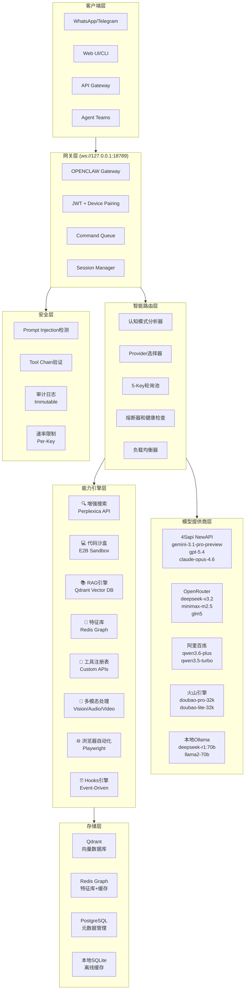

# OPENCLAW 4.1 企业级多模型调度系统完整方案

## 1. 系统概述

### 1.1 核心设计理念
- **原生全能力集成**：支持 5 大主流 LLM 提供商原生 API 集成
- **5-Key 高可用路由**：每个 Provider 配置 5 个 API Key 轮询池
- **NewAPI 协议接入**：支持最新 API 协议和流式响应
- **企业级高并发底座**：支持 1000+ QPS 的高并发处理能力

### 1.2 技术栈
- **后端**：Python 3.11+，FastAPI，aiohttp，Redis，PostgreSQL
- **前端**：React 18，TypeScript，Tailwind CSS，WebSocket
- **数据库**：PostgreSQL（元数据），Redis（缓存），Qdrant（向量）
- **部署**：Docker，Kubernetes，Nginx，Prometheus，Grafana

## 2. 详细架构设计图

### 2.1 系统架构总览
```
┌─────────────────────────────────────────────────────────────────────────┐
│                          OPENCLAW 4.1 企业级架构                          │
├─────────────────────────────────────────────────────────────────────────┤
│                                                                         │
│  ┌─────────────┐    ┌─────────────┐    ┌─────────────┐                │
│  │   客户端层   │    │   网关层     │    │   路由层     │                │
│  │ • WhatsApp  │    │ • WebSocket │    │ • 5-Key池   │                │
│  │ • Telegram  │    │ • JWT认证   │    │ • 熔断器    │                │
│  │ • Web UI    │    │ • 命令队列   │    │ • 负载均衡   │                │
│  │ • API       │    │ • Session   │    │ • 健康检查   │                │
│  └──────┬──────┘    └──────┬──────┘    └──────┬──────┘                │
│         │                  │                  │                       │
│  ┌──────┴──────┐    ┌──────┴──────┐    ┌──────┴──────┐                │
│  │   能力层     │    │   模型层     │    │   存储层     │                │
│  │ • 搜索引擎  │    │ • 4Sapi     │    │ • Qdrant    │                │
│  │ • 代码沙盒  │    │ • OpenRouter│    │ • Redis     │                │
│  │ • RAG引擎   │    │ • 阿里百炼   │    │ • PostgreSQL│                │
│  │ • 工具注册表 │    │ • 火山引擎   │    │ • SQLite    │                │
│  │ • 浏览器自动化│    │ • Ollama    │    └─────────────┘                │
│  └─────────────┘    └─────────────┘                                     │
│                                                                         │
└─────────────────────────────────────────────────────────────────────────┘
```

### 2.2 数据流架构


## 3. 架构设计 AI 解析语言 (Design Rationale)

### 3.1 设计原则

#### 3.1.1 分层解耦原则
```
Layer Separation Principle:
├── Client Layer: 纯展示，无业务逻辑
├── Gateway Layer: 协议转换，认证授权
├── Router Layer: 智能调度，故障转移
├── Model Layer: 模型抽象，统一接口
├── Capability Layer: 能力编排，工具集成
├── Storage Layer: 数据持久化
└── Security Layer: 全链路安全
```

#### 3.1.2 高可用设计
```yaml
high_availability:
  key_pooling: "5-keys per provider"
  circuit_breaker:
    threshold: 5
    cooldown_sec: 60
  health_check:
    interval_sec: 30
    timeout_sec: 5
  failover_chain:
    - primary: "4sapi_gemini-3.1-pro"
    - secondary: "openrouter_deepseek-v3.2"
    - tertiary: "bailian_qwen3.6-plus"
    - fallback: "local_ollama"
```

#### 3.1.3 性能优化策略
```python
performance_optimization:
  connection_pooling:
    total_connections: 100
    per_host: 20
    keepalive_timeout: 30
  latency_compensation:
    aggregated_api_latency_ms: 200
    timeout_multiplier:
      think: 2.5
      fast: 1.0
      act: 1.5
  streaming_optimization:
    chunk_size: 4096
    buffer_accumulation: true
    utf8_boundary_handling: true
```

### 3.2 认知模式设计

#### 3.2.1 Think 模式（深度推理）
```yaml
think_mode:
  purpose: "复杂问题深度分析和多步推理"
  timeout_multiplier: 2.5
  preferred_models:
    - "deepseek-v3.2"
    - "claude-opus-4.6"
    - "gemini-3.1-pro"
  characteristics:
    - "支持长上下文（128K-1M）"
    - "多步推理能力"
    - "成本敏感度低"
```

#### 3.2.2 Fast 模式（快速响应）
```yaml
fast_mode:
  purpose: "对话、简单问答等快速响应场景"
  timeout_multiplier: 1.0
  preferred_models:
    - "gpt-5.4"
    - "gemini-3.1-pro"
    - "qwen3.6-plus"
  characteristics:
    - "低延迟（< 2s）"
    - "实时API支持"
    - "成本优化"
```

#### 3.2.3 Act 模式（工具执行）
```yaml
act_mode:
  purpose: "工具调用、代码执行、API操作"
  timeout_multiplier: 1.5
  preferred_models:
    - "gpt-5.4"
    - "claude-opus-4.6"
    - "qwen3.6-plus"
  characteristics:
    - "函数调用支持"
    - "工具集成能力"
    - "延长超时处理"
```

## 4. 全局永久变量配置

### 4.1 环境变量配置 (.env)

```bash
# ==================== 基础配置 ====================
OPENCLAW_ENV=production
OPENCLAW_HOST=0.0.0.0
OPENCLAW_PORT=18789
OPENCLAW_WORKERS=4
OPENCLAW_LOG_LEVEL=INFO

# ==================== 超时配置 ====================
DEFAULT_TIMEOUT_SEC=120
LONG_TASK_TIMEOUT_SEC=300
STREAM_READ_TIMEOUT_SEC=30
KEEPALIVE_INTERVAL_SEC=25

# ==================== 熔断器配置 ====================
CIRCUIT_BREAKER_THRESHOLD=5
CIRCUIT_BREAKER_COOLDOWN_SEC=60
HEALTH_CHECK_INTERVAL_SEC=30

# ==================== 4Sapi NewAPI（主通道）====================
FOURSAPI_BASE_URL=https://4sapi.com/v1
FOURSAPI_KEYS=sk-4s-key1,sk-4s-key2,sk-4s-key3,sk-4s-key4,sk-4s-key5
FOURSAPI_PRIORITY=1
FOURSAPI_TIMEOUT_SEC=120
FOURSAPI_RETRY_TIMES=3
FOURSAPI_RETRY_DELAY_MS=1000

# ==================== OpenRouter（备用通道）====================
OPENROUTER_BASE_URL=https://openrouter.ai/api/v1
OPENROUTER_KEYS=sk-or-key1,sk-or-key2,sk-or-key3,sk-or-key4,sk-or-key5
OPENROUTER_PRIORITY=2
OPENROUTER_TIMEOUT_SEC=150
OPENROUTER_RETRY_TIMES=3

# ==================== 阿里百炼 DashScope ====================
BAILIAN_BASE_URL=https://dashscope.aliyuncs.com/compatible-mode/v1
BAILIAN_KEYS=sk-bl-key1,sk-bl-key2,sk-bl-key3,sk-bl-key4,sk-bl-key5
BAILIAN_PRIORITY=3
BAILIAN_TIMEOUT_SEC=120
BAILIAN_RETRY_TIMES=2

# ==================== 火山引擎方舟 ====================
VOLCENGINE_BASE_URL=https://ark.cn-beijing.volces.com/api/v3
VOLCENGINE_KEYS=sk-vc-key1,sk-vc-key2,sk-vc-key3,sk-vc-key4,sk-vc-key5
VOLCENGINE_PRIORITY=4
VOLCENGINE_TIMEOUT_SEC=120
VOLCENGINE_RETRY_TIMES=2

# ==================== 本地Ollama ====================
OLLAMA_BASE_URL=http://127.0.0.1:11434/v1
OLLAMA_ENABLED=false
OLLAMA_PRIORITY=99
OLLAMA_TIMEOUT_SEC=180
OLLAMA_RETRY_TIMES=1

# ==================== 数据库配置 ====================
POSTGRES_HOST=localhost
POSTGRES_PORT=5432
POSTGRES_DB=openclaw
POSTGRES_USER=openclaw
POSTGRES_PASSWORD=your_password

REDIS_HOST=localhost
REDIS_PORT=6379
REDIS_DB=0
REDIS_PASSWORD=

QDRANT_HOST=localhost
QDRANT_PORT=6333

# ==================== 能力引擎端点 ====================
SEARCH_BACKEND_URL=http://localhost:8080
CODE_SANDBOX_URL=http://localhost:50051
RAG_BACKEND_URL=http://localhost:6333
BROWSER_AUTOMATION_URL=http://localhost:3000

# ==================== 监控配置 ====================
PROMETHEUS_ENABLED=true
PROMETHEUS_PORT=9090
GRAFANA_ENABLED=true
GRAFANA_PORT=3000
```

### 4.2 模型配置文件 (config/models.yaml)

```yaml
# OPENCLAW 4.1 模型路由配置
version: "4.1.0"
last_updated: "2026-04-10"

providers:
  foursapi:
    name: "4Sapi NewAPI"
    type: openai_compatible
    base_url_env: FOURSAPI_BASE_URL
    keys_env: FOURSAPI_KEYS
    timeout_env: FOURSAPI_TIMEOUT_SEC
    priority_env: FOURSAPI_PRIORITY
    retry_times: 3
    retry_delay_ms: 1000
    extra_latency_ms: 200
    keepalive: true
    circuit_breaker: true

  openrouter:
    name: "OpenRouter"
    type: openai_compatible
    base_url_env: OPENROUTER_BASE_URL
    keys_env: OPENROUTER_KEYS
    timeout_env: OPENROUTER_TIMEOUT_SEC
    priority_env: OPENROUTER_PRIORITY
    retry_times: 3
    retry_delay_ms: 1000
    extra_headers:
      HTTP-Referer: "https://openclaw.ai"
      X-Title: "OPENCLAW-4.1"
    circuit_breaker: true

  bailian:
    name: "阿里百炼 DashScope"
    type: openai_compatible
    base_url_env: BAILIAN_BASE_URL
    keys_env: BAILIAN_KEYS
    timeout_env: BAILIAN_TIMEOUT_SEC
    priority_env: BAILIAN_PRIORITY
    retry_times: 2
    circuit_breaker: true

  volcengine:
    name: "火山引擎方舟"
    type: openai_compatible
    base_url_env: VOLCENGINE_BASE_URL
    keys_env: VOLCENGINE_KEYS
    timeout_env: VOLCENGINE_TIMEOUT_SEC
    priority_env: VOLCENGINE_PRIORITY
    retry_times: 2
    circuit_breaker: true

  ollama:
    name: "本地Ollama"
    type: ollama
    base_url_env: OLLAMA_BASE_URL
    enabled_env: OLLAMA_ENABLED
    priority_env: OLLAMA_PRIORITY
    timeout_env: OLLAMA_TIMEOUT_SEC
    retry_times: 1
    circuit_breaker: false

models:
  # 4Sapi 模型
  gemini-3.1-pro:
    provider: foursapi
    model_id: "gemini-3.1-pro-preview"
    display_name: "Gemini 3.1 Pro Preview"
    context_window: 1000000
    max_output_tokens: 8192
    capabilities: ["reasoning", "vision", "code", "long_context"]
    mode: ["think", "fast", "act"]
    cost_per_1k:
      input: 0.01
      output: 0.03
    supported_tools: ["search", "calculator", "browser"]

  gpt-5.4:
    provider: foursapi
    model_id: "gpt-5.4"
    display_name: "GPT-5.4"
    context_window: 256000
    max_output_tokens: 16384
    capabilities: ["reasoning", "vision", "code", "realtime"]
    mode: ["fast", "act"]
    cost_per_1k:
      input: 0.015
      output: 0.06
    supported_tools: ["function_calling", "code_interpreter"]

  claude-opus-4.6:
    provider: foursapi
    model_id: "claude-opus-4.6"
    display_name: "Claude Opus 4.6"
    context_window: 200000
    max_output_tokens: 4096
    capabilities: ["reasoning", "analysis", "writing"]
    mode: ["think", "act"]
    cost_per_1k:
      input: 0.075
      output: 0.225
    supported_tools: ["tool_use", "file_processing"]

  # OpenRouter 模型
  deepseek-v3.2:
    provider: openrouter
    model_id: "deepseek/deepseek-v3.2"
    display_name: "DeepSeek V3.2"
    context_window: 128000
    max_output_tokens: 4096
    capabilities: ["reasoning", "math", "code"]
    mode: ["think", "fast"]
    cost_per_1k:
      input: 0.001
      output: 0.002
    supported_tools: ["search", "calculator"]

  # 百炼模型
  qwen3.6-plus:
    provider: bailian
    model_id: "qwen3.6-plus"
    display_name: "Qwen 3.6 Plus"
    context_window: 131072
    max_output_tokens: 8192
    capabilities: ["reasoning", "chinese", "code"]
    mode: ["fast", "act"]
    cost_per_1k:
      input: 0.008
      output: 0.002
    supported_tools: ["function_call", "plugins"]

  # 火山引擎模型
  doubao-pro-32k:
    provider: volcengine
    model_id: "doubao-pro-32k"
    display_name: "豆包 Pro 32K"
    context_window: 32768
    max_output_tokens: 4096
    capabilities: ["chinese", "creative", "dialogue"]
    mode: ["fast"]
    cost_per_1k:
      input: 0.005
      output: 0.01
    supported_tools: ["search", "calculator"]

routing:
  default_model: "gemini-3.1-pro"
  default_provider: "foursapi"
  
  cognitive_modes:
    think:
      preferred: ["deepseek-v3.2", "claude-opus-4.6", "gemini-3.1-pro"]
      fallback: ["qwen3.6-plus", "local-deepseek"]
      timeout_multiplier: 2.5
      max_retries: 2
    
    fast:
      preferred: ["gpt-5.4", "gemini-3.1-pro", "qwen3.6-plus"]
      fallback: ["glm5", "minimax-m2.5", "local-qwen"]
      timeout_multiplier: 1.0
      max_retries: 1
    
    act:
      preferred: ["gpt-5.4", "claude-opus-4.6", "qwen3.6-plus"]
      fallback: ["gemini-3.1-pro", "glm5"]
      timeout_multiplier: 1.5
      max_retries: 2
  
  failover_chains:
    preview:
      - "sapi_gpt54"
      - "sapi_opus46"
      - "sapi_gemini_p"
      - "or_deepseek_v32"
    
    production:
      - "sapi_gemini_p"
      - "bl_qwen36p"
      - "or_deepseek_v32"
    
    fast_response:
      - "or_deepseek_v32"
      - "or_minimax_m25"
      - "bl_glm5"

capabilities:
  search:
    enabled: true
    provider: "perplexica"
    endpoint: "/api/search"
    timeout_sec: 30
  
  code:
    enabled: true
    provider: "e2b"
    endpoint: "/api/code"
    timeout_sec: 60
    sandbox_timeout_sec: 300
  
  rag:
    enabled: true
    provider: "qdrant"
    endpoint: "/api/rag"
    timeout_sec: 45
    max_chunks: 10
  
  browser:
    enabled: true
    provider: "playwright"
    endpoint: "/api/browser"
    timeout_sec: 120
    headless: true
```

## 5. 执行部署命令

### 5.1 快速部署脚本 (deploy.sh)

```bash
#!/bin/bash

# OPENCLAW 4.1 企业级部署脚本
set -e

echo "🚀 开始部署 OPENCLAW 4.1 企业级多模型调度系统..."

# 检查环境
check_environment() {
    echo "🔍 检查系统环境..."
    
    # 检查 Python 版本
    python_version=$(python3 --version | cut -d' ' -f2)
    if [[ "$python_version" < "3.11.0" ]]; then
        echo "❌ Python 版本需要 >= 3.11.0，当前版本: $python_version"
        exit 1
    fi
    echo "✅ Python 版本: $python_version"
    
    # 检查 Docker
    if command -v docker &> /dev/null; then
        echo "✅ Docker 已安装"
    else
        echo "⚠️  Docker 未安装，将跳过容器化部署"
    fi
    
    # 检查 Redis
    if command -v redis-cli &> /dev/null; then
        echo "✅ Redis 已安装"
    else
        echo "⚠️  Redis 未安装"
    fi
}

# 安装依赖
install_dependencies() {
    echo "📦 安装系统依赖..."
    
    # Ubuntu/Debian
    if [[ -f /etc/debian_version ]]; then
        apt-get update
        apt-get install -y \
            python3-pip \
            python3-venv \
            redis-server \
            postgresql \
            postgresql-contrib \
            nginx \
            certbot \
            python3-certbot-nginx
    # CentOS/RHEL
    elif [[ -f /etc/redhat-release ]]; then
        yum install -y \
            python3-pip \
            python3-devel \
            redis \
            postgresql-server \
            postgresql-contrib \
            nginx \
            certbot \
            python3-certbot-nginx
    else
        echo "⚠️  不支持的操作系统，请手动安装依赖"
    fi
}

# 创建虚拟环境
setup_venv() {
    echo "🐍 创建 Python 虚拟环境..."
    
    if [[ ! -d "venv" ]]; then
        python3 -m venv venv
    fi
    
    source venv/bin/activate
    
    # 安装 Python 依赖
    echo "📦 安装 Python 依赖..."
    pip install --upgrade pip
    
    cat > requirements.txt << 'EOF'
# OPENCLAW 4.1 企业级依赖
fastapi==0.104.1
uvicorn[standard]==0.24.0
pydantic==2.5.0
aiohttp==3.9.1
aioredis==2.0.1
asyncpg==0.29.0
sqlalchemy==2.0.23
alembic==1.12.1
psycopg2-binary==2.9.9
redis==5.0.1
qdrant-client==1.7.0
openai==1.3.0
anthropic==0.7.4
google-generativeai==0.3.0
tenacity==8.2.3
pytest==7.4.3
pytest-asyncio==0.21.1
httpx==0.25.1
websockets==12.0
celery==5.3.4
flower==2.0.1
prometheus-client==0.19.0
structlog==23.2.0
python-dotenv==1.0.0
pyyaml==6.0.1
jwt==1.3.1
bcrypt==4.1.2
cryptography==41.0.7
EOF
    
    pip install -r requirements.txt
}

# 配置数据库
setup_database() {
    echo "🗄️  配置数据库..."
    
    # PostgreSQL
    if [[ -f /etc/debian_version ]]; then
        sudo -u postgres psql << 'EOF'
CREATE DATABASE openclaw;
CREATE USER openclaw WITH PASSWORD 'your_password';
GRANT ALL PRIVILEGES ON DATABASE openclaw TO openclaw;
ALTER DATABASE openclaw SET timezone TO 'UTC';
EOF
    fi
    
    # Redis
    if command -v redis-cli &> /dev/null; then
        redis-cli config set requirepass "your_redis_password"
        systemctl restart redis
    fi
}

# 创建配置文件
setup_config() {
    echo "⚙️  创建配置文件..."
    
    mkdir -p config
    
    # 创建 .env 文件
    cat > .env << 'EOF'
# OPENCLAW 4.1 环境配置
OPENCLAW_ENV=production
OPENCLAW_HOST=0.0.0.0
OPENCLAW_PORT=18789
OPENCLAW_WORKERS=4
OPENCLAW_LOG_LEVEL=INFO

# 数据库配置
POSTGRES_HOST=localhost
POSTGRES_PORT=5432
POSTGRES_DB=openclaw
POSTGRES_USER=openclaw
POSTGRES_PASSWORD=your_password

REDIS_HOST=localhost
REDIS_PORT=6379
REDIS_DB=0
REDIS_PASSWORD=your_redis_password

QDRANT_HOST=localhost
QDRANT_PORT=6333

# 4Sapi 配置
FOURSAPI_BASE_URL=https://4sapi.com/v1
FOURSAPI_KEYS=sk-4s-key1,sk-4s-key2,sk-4s-key3,sk-4s-key4,sk-4s-key5
FOURSAPI_PRIORITY=1
FOURSAPI_TIMEOUT_SEC=120

# OpenRouter 配置
OPENROUTER_BASE_URL=https://openrouter.ai/api/v1
OPENROUTER_KEYS=sk-or-key1,sk-or-key2,sk-or-key3,sk-or-key4,sk-or-key5
OPENROUTER_PRIORITY=2
OPENROUTER_TIMEOUT_SEC=150

# 其他配置...
EOF
    
    echo "⚠️  请编辑 .env 文件，填入实际的 API Key 和密码"
}

# 创建 Docker Compose 配置
setup_docker() {
    echo "🐳 创建 Docker Compose 配置..."
    
    cat > docker-compose.yml << 'EOF'
version: '3.8'

services:
  # OPENCLAW 主服务
  openclaw:
    build: .
    container_name: openclaw
    restart: unless-stopped
    ports:
      - "18789:18789"
    environment:
      - OPENCLAW_ENV=production
      - OPENCLAW_HOST=0.0.0.0
      - OPENCLAW_PORT=18789
    volumes:
      - ./config:/app/config
      - ./logs:/app/logs
      - ./data:/app/data
    depends_on:
      - postgres
      - redis
      - qdrant
    networks:
      - openclaw-network

  # PostgreSQL 数据库
  postgres:
    image: postgres:15-alpine
    container_name: openclaw-postgres
    restart: unless-stopped
    environment:
      POSTGRES_DB: openclaw
      POSTGRES_USER: openclaw
      POSTGRES_PASSWORD: your_password
    volumes:
      - postgres_data:/var/lib/postgresql/data
      - ./init.sql:/docker-entrypoint-initdb.d/init.sql
    ports:
      - "5432:5432"
    networks:
      - openclaw-network

  # Redis 缓存
  redis:
    image: redis:7-alpine
    container_name: openclaw-redis
    restart: unless-stopped
    command: redis-server --requirepass your_redis_password
    volumes:
      - redis_data:/data
    ports:
      - "6379:6379"
    networks:
      - openclaw-network

  # Qdrant 向量数据库
  qdrant:
    image: qdrant/qdrant:latest
    container_name: openclaw-qdrant
    restart: unless-stopped
    volumes:
      - qdrant_data:/qdrant/storage
    ports:
      - "6333:6333"
      - "6334:6334"
    networks:
      - openclaw-network

  # Nginx 反向代理
  nginx:
    image: nginx:alpine
    container_name: openclaw-nginx
    restart: unless-stopped
    ports:
      - "80:80"
      - "443:443"
    volumes:
      - ./nginx.conf:/etc/nginx/nginx.conf
      - ./ssl:/etc/nginx/ssl
    depends_on:
      - openclaw
    networks:
      - openclaw-network

  # Prometheus 监控
  prometheus:
    image: prom/prometheus:latest
    container_name: openclaw-prometheus
    restart: unless-stopped
    volumes:
      - ./prometheus.yml:/etc/prometheus/prometheus.yml
      - prometheus_data:/prometheus
    ports:
      - "9090:9090"
    networks:
      - openclaw-network

  # Grafana 仪表板
  grafana:
    image: grafana/grafana:latest
    container_name: openclaw-grafana
    restart: unless-stopped
    environment:
      - GF_SECURITY_ADMIN_PASSWORD=admin
    volumes:
      - grafana_data:/var/lib/grafana
      - ./grafana/provisioning:/etc/grafana/provisioning
    ports:
      - "3000:3000"
    networks:
      - openclaw-network

volumes:
  postgres_data:
  redis_data:
  qdrant_data:
  prometheus_data:
  grafana_data:

networks:
  openclaw-network:
    driver: bridge
EOF

    # 创建 Dockerfile
    cat > Dockerfile << 'EOF'
FROM python:3.11-slim

WORKDIR /app

# 安装系统依赖
RUN apt-get update && apt-get install -y \
    gcc \
    g++ \
    libpq-dev \
    && rm -rf /var/lib/apt/lists/*

# 复制依赖文件
COPY requirements.txt .

# 安装 Python 依赖
RUN pip install --no-cache-dir --upgrade pip && \
    pip install --no-cache-dir -r requirements.txt

# 复制应用代码
COPY . .

# 创建非 root 用户
RUN useradd -m -u 1000 openclaw && \
    chown -R openclaw:openclaw /app

USER openclaw

# 暴露端口
EXPOSE 18789

# 启动命令
CMD ["uvicorn", "main:app", "--host", "0.0.0.0", "--port", "18789", "--workers", "4"]
EOF
}

# 创建 Nginx 配置
setup_nginx() {
    echo "🌐 创建 Nginx 配置..."
    
    cat > nginx.conf << 'EOF'
user nginx;
worker_processes auto;
error_log /var/log/nginx/error.log warn;
pid /var/run/nginx.pid;

events {
    worker_connections 1024;
    use epoll;
    multi_accept on;
}

http {
    include /etc/nginx/mime.types;
    default_type application/octet-stream;

    log_format main '$remote_addr - $remote_user [$time_local] "$request" '
                    '$status $body_bytes_sent "$http_referer" '
                    '"$http_user_agent" "$http_x_forwarded_for"';

    access_log /var/log/nginx/access.log main;

    sendfile on;
    tcp_nopush on;
    tcp_nodelay on;
    keepalive_timeout 65;
    keepalive_requests 1000;
    types_hash_max_size 2048;

    # 限制请求大小
    client_max_body_size 100M;
    client_body_buffer_size 128k;

    # Gzip 压缩
    gzip on;
    gzip_vary on;
    gzip_min_length 1024;
    gzip_proxied any;
    gzip_comp_level 6;
    gzip_types
        text/plain
        text/css
        text/xml
        text/javascript
        application/json
        application/javascript
        application/xml+rss
        application/atom+xml
        image/svg+xml;

    # 上游服务
    upstream openclaw_backend {
        least_conn;
        server openclaw:18789 max_fails=3 fail_timeout=30s;
        keepalive 32;
    }

    # HTTP 服务器（重定向到 HTTPS）
    server {
        listen 80;
        server_name openclaw.yourdomain.com;
        return 301 https://$server_name$request_uri;
    }

    # HTTPS 服务器
    server {
        listen 443 ssl http2;
        server_name openclaw.yourdomain.com;

        ssl_certificate /etc/nginx/ssl/fullchain.pem;
        ssl_certificate_key /etc/nginx/ssl/privkey.pem;
        ssl_session_timeout 1d;
        ssl_session_cache shared:SSL:50m;
        ssl_session_tickets off;

        ssl_protocols TLSv1.2 TLSv1.3;
        ssl_ciphers ECDHE-RSA-AES256-GCM-SHA512:DHE-RSA-AES256-GCM-SHA512:ECDHE-RSA-AES256-GCM-SHA384:DHE-RSA-AES256-GCM-SHA384;
        ssl_prefer_server_ciphers off;

        # HSTS
        add_header Strict-Transport-Security "max-age=63072000" always;

        # 安全头
        add_header X-Frame-Options DENY;
        add_header X-Content-Type-Options nosniff;
        add_header X-XSS-Protection "1; mode=block";

        # WebSocket 支持
        location /ws/ {
            proxy_pass http://openclaw_backend;
            proxy_http_version 1.1;
            proxy_set_header Upgrade $http_upgrade;
            proxy_set_header Connection "upgrade";
            proxy_set_header Host $host;
            proxy_set_header X-Real-IP $remote_addr;
            proxy_set_header X-Forwarded-For $proxy_add_x_forwarded_for;
            proxy_set_header X-Forwarded-Proto $scheme;
            
