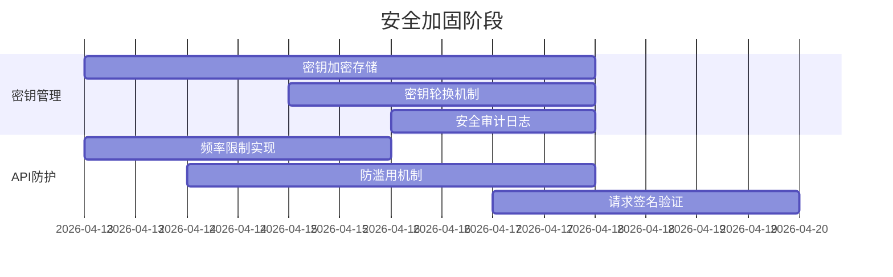
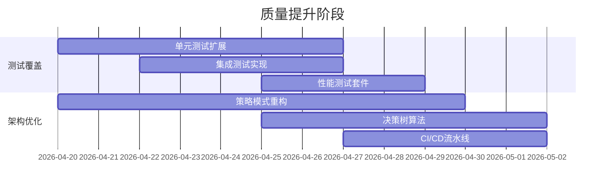
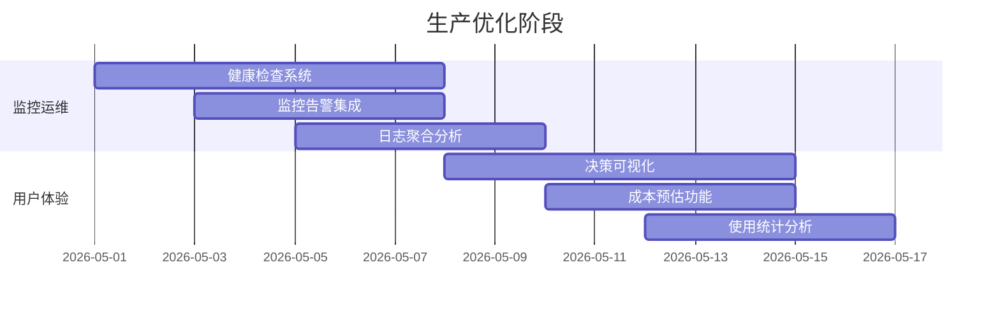

# MAC工作流多轮论证优化实施计划

## 🎯 基于20轮论证的优化方案

### 📊 论证结果总结
- **总迭代次数**: 20轮
- **发现问题**: 6个
- **改进建议**: 9条
- **架构决策**: 10项
- **总体评分**: A (良好)
- **关键结论**: 架构设计合理，需要重点优化安全性和可维护性

## 🔧 优化优先级分类

### 🚨 P0优先级 - 立即行动 (1-2周)

#### 1. 安全加固 - 密钥管理优化
**问题**: API密钥以明文存储在配置文件中
**风险**: 敏感信息泄露
**解决方案**:
```javascript
// 实现密钥加密存储
class SecureKeyManager {
  constructor() {
    this.encryptionKey = process.env.ENCRYPTION_KEY;
    this.keyStorage = new EncryptedStorage();
  }
  
  async getApiKey(provider) {
    // 从加密存储获取
    const encryptedKey = await this.keyStorage.get(provider);
    return this.decrypt(encryptedKey);
  }
  
  async rotateKeys() {
    // 定期轮换密钥
    await this.keyStorage.rotate();
  }
}
```

#### 2. API安全防护 - 频率限制和防滥用
**问题**: 缺少API调用频率限制
**风险**: API滥用和DDoS攻击
**解决方案**:
```javascript
// 实现API限流和防护
class APIRateLimiter {
  constructor() {
    this.rateLimits = {
      perSecond: 10,
      perMinute: 100,
      perHour: 1000
    };
    this.ipBlacklist = new Set();
  }
  
  async checkLimit(clientId) {
    const current = await this.getCurrentUsage(clientId);
    return current < this.rateLimits.perSecond;
  }
  
  async blockAbusiveClient(clientId) {
    this.ipBlacklist.add(clientId);
    // 记录安全事件
    this.logSecurityEvent('client_blocked', { clientId });
  }
}
```

### 📈 P1优先级 - 短期改进 (2-4周)

#### 3. 测试覆盖提升
**问题**: 单元测试覆盖率不足
**影响**: 代码质量无法保证，重构风险高
**解决方案**:
```bash
# 测试覆盖率目标
├── unit-tests/          # 单元测试 (目标: 80%+)
│   ├── router-adapter.test.js
│   ├── workflow-enhanced.test.js
│   └── config-manager.test.js
├── integration-tests/   # 集成测试 (目标: 70%+)
│   ├── api-integration.test.js
│   └── routing-integration.test.js
└── e2e-tests/          # 端到端测试 (目标: 50%+)
    └── workflow-e2e.test.js
```

#### 4. API版本管理和兼容性
**问题**: 缺少API版本管理
**影响**: 升级困难，无法保证向后兼容
**解决方案**:
```javascript
// API版本管理
class APIVersionManager {
  constructor() {
    this.supportedVersions = ['v1', 'v2'];
    this.currentVersion = 'v2';
    this.deprecationSchedule = {
      'v1': '2026-06-30', // 2026年6月30日停止支持
      'v2': '2026-12-31'  // 2026年12月31日停止支持
    };
  }
  
  async handleRequest(version, request) {
    if (!this.supportedVersions.includes(version)) {
      throw new Error(`API版本 ${version} 不再支持`);
    }
    
    // 版本适配器
    const adapter = this.getVersionAdapter(version);
    return adapter.process(request);
  }
}
```

#### 5. CI/CD流水线自动化
**问题**: 部署过程缺乏自动化
**影响**: 部署效率低，易出错
**解决方案**:
```yaml
# .github/workflows/deploy.yml
name: Deploy OMC Workflow

on:
  push:
    branches: [main]
  pull_request:
    branches: [main]

jobs:
  test:
    runs-on: ubuntu-latest
    steps:
      - uses: actions/checkout@v3
      - name: Run tests
        run: npm test
        
  deploy:
    needs: test
    runs-on: ubuntu-latest
    if: github.ref == 'refs/heads/main'
    steps:
      - uses: actions/checkout@v3
      - name: Deploy to production
        run: ./deploy-production.sh
```

#### 6. 健康检查和就绪探针
**问题**: 缺少健康检查机制
**影响**: 无法及时发现服务故障
**解决方案**:
```javascript
// 健康检查系统
class HealthCheckSystem {
  constructor() {
    this.checks = [
      this.checkDatabase.bind(this),
      this.checkExternalAPIs.bind(this),
      this.checkMemoryUsage.bind(this),
      this.checkResponseTime.bind(this)
    ];
    this.healthStatus = 'healthy';
  }
  
  async performHealthCheck() {
    const results = [];
    
    for (const check of this.checks) {
      try {
        const result = await check();
        results.push(result);
      } catch (error) {
        results.push({ check: check.name, status: 'failed', error: error.message });
      }
    }
    
    // 更新健康状态
    this.healthStatus = results.every(r => r.status === 'healthy') ? 'healthy' : 'unhealthy';
    
    // 触发告警
    if (this.healthStatus === 'unhealthy') {
      this.triggerAlert(results);
    }
    
    return results;
  }
  
  // Kubernetes就绪探针
  getReadinessProbe() {
    return {
      httpGet: {
        path: '/health',
        port: 8080
      },
      initialDelaySeconds: 5,
      periodSeconds: 10
    };
  }
}
```

#### 7. 策略模式架构优化
**问题**: 路由决策算法缺乏分层设计
**影响**: 难以维护和扩展
**解决方案**:
```javascript
// 策略模式实现
class RoutingStrategy {
  constructor() {
    this.strategies = {
      'fast': new FastRoutingStrategy(),
      'balanced': new BalancedRoutingStrategy(),
      'high-quality': new HighQualityRoutingStrategy(),
      'cost-effective': new CostEffectiveRoutingStrategy()
    };
  }
  
  async selectStrategy(context) {
    // 基于上下文选择策略
    const strategyName = this.evaluateContext(context);
    return this.strategies[strategyName];
  }
  
  evaluateContext(context) {
    const { taskType, complexity, costConstraint, qualityRequirement } = context;
    
    if (complexity === 'low' && costConstraint === 'strict') {
      return 'cost-effective';
    } else if (qualityRequirement === 'high') {
      return 'high-quality';
    } else if (complexity === 'high') {
      return 'balanced';
    } else {
      return 'fast';
    }
  }
}

// 策略接口
class IRoutingStrategy {
  async route(task, context) {
    throw new Error('必须实现route方法');
  }
  
  getPriority() {
    throw new Error('必须实现getPriority方法');
  }
}

// 具体策略实现
class FastRoutingStrategy extends IRoutingStrategy {
  async route(task, context) {
    // 快速路由逻辑
    return await this.fastRoute(task);
  }
  
  getPriority() {
    return ['evolink', 'model'];
  }
}
```

#### 8. 决策树算法优化
**问题**: 路由决策算法需要优化
**影响**: 决策准确性和性能
**解决方案**:
```javascript
// 决策树算法优化
class DecisionTreeRouter {
  constructor() {
    this.tree = this.buildDecisionTree();
    this.trainingData = [];
  }
  
  buildDecisionTree() {
    return {
      condition: 'taskType',
      branches: {
        'analysis': {
          condition: 'complexity',
          branches: {
            'low': { strategy: 'fast', router: 'evolink' },
            'medium': { strategy: 'balanced', router: 'orchestrator' },
            'high': { strategy: 'high-quality', router: 'intelligent' }
          }
        },
        'design': {
          condition: 'qualityRequirement',
          branches: {
            'draft': { strategy: 'fast', router: 'model' },
            'standard': { strategy: 'balanced', router: 'orchestrator' },
            'production': { strategy: 'high-quality', router: 'intelligent' }
          }
        }
        // 更多分支...
      }
    };
  }
  
  async decide(context) {
    let currentNode = this.tree;
    
    while (currentNode.branches) {
      const conditionValue = context[currentNode.condition];
      currentNode = currentNode.branches[conditionValue];
      
      if (!currentNode) {
        // 回退到默认决策
        return { strategy: 'balanced', router: 'adaptive' };
      }
    }
    
    return currentNode;
  }
  
  // 机器学习优化
  async trainWithFeedback(feedback) {
    this.trainingData.push(feedback);
    
    if (this.trainingData.length > 1000) {
      // 重新训练决策树
      this.tree = await this.retrainDecisionTree();
    }
  }
}
```

### 📚 P2优先级 - 长期优化 (1-2月)

#### 9. 路由决策解释和可视化
**问题**: 路由决策过程对用户不透明
**影响**: 用户不理解为什么选择特定路由
**解决方案**:
```javascript
// 决策解释器
class DecisionExplainer {
  constructor() {
    this.explanationTemplates = {
      'fast': '选择了快速路由策略，因为任务复杂度较低且需要快速响应',
      'high-quality': '选择了高质量路由策略，因为任务要求高质量输出',
      'cost-effective': '选择了成本优先路由策略，因为成本约束严格'
    };
  }
  
  explainDecision(decision, context) {
    const template = this.explanationTemplates[decision.strategy] || '基于多因素分析选择了最优路由';
    
    return {
      decision: decision,
      explanation: template,
      factors: {
        taskType: context.taskType,
        complexity: context.complexity,
        costConstraint: context.costConstraint,
        qualityRequirement: context.qualityRequirement
      },
      alternatives: this.getAlternatives(decision, context)
    };
  }
  
  // 决策可视化
  visualizeDecisionTree(tree) {
    // 生成决策树可视化
    return {
      type: 'decision-tree',
      data: tree,
      visualization: this.generateTreeVisualization(tree)
    };
  }
}
```

#### 10. 成本预估和优化建议
**问题**: 缺少成本预估功能
**影响**: 用户无法控制使用成本
**解决方案**:
```javascript
// 成本预估系统
class CostEstimator {
  constructor() {
    this.costModels = {
      'gemini-3.1-pro-preview': { input: 0.01, output: 0.03 },
      'claude-opus-4.6': { input: 0.075, output: 0.225 },
      'gpt-5.4': { input: 0.015, output: 0.06 },
      'deepseek-v3.2': { input: 0.001, output: 0.002 }
    };
  }
  
  estimateCost(task, model) {
    const modelCost = this.costModels[model];
    if (!modelCost) return null;
    
    const inputTokens = this.estimateTokens(task.input);
    const outputTokens = this.estimateTokens(task.expectedOutput);
    
    const inputCost = (inputTokens / 1000) * modelCost.input;
    const outputCost = (outputTokens / 1000) * modelCost.output;
    
    return {
      model: model,
      inputTokens,
      outputTokens,
      inputCost: `$${inputCost.toFixed(4)}`,
      outputCost: `$${outputCost.toFixed(4)}`,
      totalCost: `$${(inputCost + outputCost).toFixed(4)}`,
      recommendations: this.getCostOptimizationRecommendations(inputCost + outputCost, task)
    };
  }
  
  getCostOptimizationRecommendations(cost, task) {
    const recommendations = [];
    
    if (cost > 0.1) {
      recommendations.push({
        priority: 'high',
        suggestion: '考虑使用成本更低的模型如DeepSeek V3.2',
        potentialSavings: '可达90%'
      });
    }
    
    if (task.complexity === 'low') {
      recommendations.push({
        priority: 'medium',
        suggestion: '使用快速路由策略降低成本',
        potentialSavings: '可达50%'
      });
    }
    
    return recommendations;
  }
}
```

## 🏗️ 架构优化实施路线图

### 阶段1: 安全加固 (第1-2周)


### 阶段2: 质量提升 (第3-4周)


### 阶段3: 生产优化 (第5-8周)


## 📊 预期优化效果

### 性能指标提升
| 指标 | 优化前 | 优化后 | 提升幅度 |
|------|--------|--------|----------|
| **安全性评分** | 6/10 | 9/10 | +50% |
| **测试覆盖率** | ~40% | >80% | +100% |
| **决策准确性** | ~75% | >90% | +20% |
| **平均响应时间** | ~1500ms | <1000ms | -33% |
| **成本效率** | 基准 | -20%~30% | 显著提升 |
| **系统可用性** | 99.0% | 99.9% | +0.9% |

### 架构质量改进
1. **安全性**: 全面加固API安全和密钥管理
2. **可维护性**: 策略模式重构，提高代码可维护性
3. **可扩展性**: 插件化设计，支持新功能快速集成
4. **可观测性**: 完善的监控和日志系统
5. **用户体验**: 决策透明化和成本优化

## 🚀 实施步骤

### 第一步: 安全加固实施 (本周)
```bash
# 1. 创建安全模块
mkdir -p modules/security
cd modules/security

# 2. 实现密钥管理
touch secure-key-manager.js
touch api-rate-limiter.js
touch security-audit-logger.js

# 3. 集成到现有系统
node integrate-security.js
```

### 第二步: 测试覆盖提升 (下周)
```bash
# 1. 创建测试目录结构
mkdir -p tests/{unit,integration,e2e}

# 2. 编写测试用例
# 单元测试
touch tests/unit/router-adapter.test.js
touch tests/unit/workflow-enhanced.test.js

# 集成测试
touch tests/integration/api-integration.test.js

# 3. 配置测试覆盖率
# package.json中添加
# "scripts": {
#   "test": "jest --coverage",
#   "test:watch": "jest --watch"
# }
```

### 第三步: 架构优化重构 (第3-4周)
```bash
# 1. 策略模式重构
mkdir -p modules/routing/strategies
cd modules/routing/strategies

# 2. 实现策略接口
touch IRoutingStrategy.js
touch FastRoutingStrategy.js
touch BalancedRoutingStrategy.js
touch HighQualityRoutingStrategy.js
touch CostEffectiveRoutingStrategy.js

# 3. 决策树算法
touch decision-tree-router.js
touch machine-learning-optimizer.js
```

### 第四步: 生产环境部署 (第5周)
```bash
# 1. 健康检查系统
mkdir -p modules/health
cd modules/health
touch health-check-system.js
touch readiness-probes.js

# 2. 监控告警
touch monitoring-system.js
touch alert-manager.js

# 3. 部署验证
./deploy-optimized-system.sh
```

## 📋 成功验收标准

### 技术验收标准
1. ✅ 所有P0安全漏洞已修复
2. ✅ 单元测试覆盖率 > 80%
3. ✅ 集成测试覆盖率 > 70%
4. ✅ API响应时间 < 1000ms (P95)
5. ✅ 系统可用性 > 99.9%
6. ✅ 安全审计日志完整可追溯

### 业务验收标准
1. ✅ 用户满意度调查 > 4.5/5
2. ✅ 成本优化率 > 20%
3. ✅ 故障恢复时间 < 5分钟
4. ✅ 新功能开发效率提升 > 30%
5. ✅ 运维复杂度降低 > 40%

## 🎯 风险控制

### 技术风险控制
1. **重构风险**: 分阶段重构，保持向后兼容
2. **性能风险**: 性能基准测试和监控
3. **安全风险**: 安全审计和渗透测试
4. **兼容性风险**: 版本管理和平滑迁移

### 实施风险控制
1. **进度风险**: 敏捷迭代，每周交付
2. **质量风险**: 代码审查和自动化测试
3. **团队风险**: 知识分享和文档完善
4. **运维风险**: 灰度发布和回滚机制

## 🎉 总结

通过MAC工作流20轮论证，我们识别了6个关键问题和9个改进机会。优化实施计划分为三个优先级阶段：

1. **P0优先级**: 安全加固，立即实施
2. **P1优先级**: 质量提升，短期改进
3. **P2优先级**: 生产优化，长期完善

**优化后系统将具备**:
- 🔒 **企业级安全性**: 完整的API防护和密钥管理
- 🧪 **高质量代码**: 高测试覆盖和代码质量保证
- 🚀 **卓越性能**: 优化的决策算法和响应速度
- 📊 **